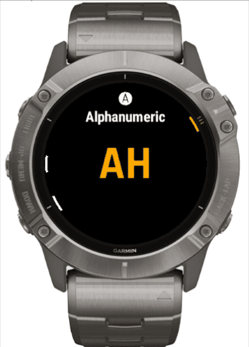
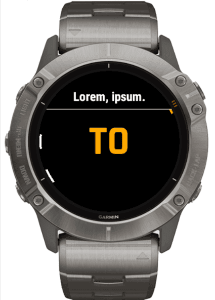

# Classic Generator W

[](https://opensource.org/licenses/MPL-2.0)

This repository contains a port of an Android App [Classic Generator](https://play.google.com/store/apps/details?id=me.venko.cg) for Garmin Watch devices. "W" stands for "Watch" or "Wearable" (on your choice).

This app is developed as a playground for applying various interesting technologies and development concepts and getting familiar with [Connect IQ SDK](https://developer.garmin.com/connect-iq/overview/). The app is still in an active development phase, so please expect some bugs, incompleteness, and general jank.

## Screenshots



## Features

There are 5 generator modes available:

* numeric (from 0 to your value)
* range (supports negative values)
* numeric fixed (non-normalized numeric with fixed length)
* alphanumeric (supports custom symbols)
* hexadecimal

Controls:

* "up"/"down" (including swipes): switch generator mode
* "start": generate new value
* "menu" long press: application menu

The last used generator mode and generated results history (limited) are preserved between app launches.

## Concepts

The project introduces multiple concepts that may be useful for Connect IQ app development.

### [UniTimer](source/common/UniTimer.mc)

Unified Timer. Performs multiple timers orchestration to make timer usage unified across the app without the need to worry about the OS limit for 3 timers. The timer instance is intended to be used as a singleton. UniTimer allows launching repeatable as well as non-repeatable timers. Each timer should be identified with a unique key. Uses single `Toybox.Timer` instance. Behavior is the same as the `Toybox.Timer`.

#### Start timer

```monkey-c
timer.start(
    "timer-key", // Unique timer identifier
    method(:onTimerTick), // Timer tick callback
    750, // Timer tick delay, ms
    true // Repeat (true | false)
);
```

#### Stop timer

```monkey-c
timer.stop("timer-key"); // Unique timer identifier
```

#### Check if timer is active

```monkey-c
timer.isActive("timer-key"); // Unique timer identifier
```

#### Limitations

UniTimer minimum delay is limited by the same value as the system timer (50 ms in most cases). This limitation may decrease precision if multiple timers use a minimum or close to minimum delay values and/or the timer ticks fall into this time window.

### [Alert](source/view/common/Alert.mc)

Simple alert dialog for displaying information, warning, or error messages. Supports multiline text that exceeds screen viewport. Can be scrolled manually and/or automatically. Alert view wraps the text with consideration of device screen shape. On the round device screen, the alert view will wrap text to fit into a visible viewport. Supports configurable displaying timeout.

The component is based on [WrapText](https://gitlab.com/harryonline/fortune-quote/-/blob/1e70f80fa07028d6adcf2c39b79c80f0f538db36/source/WrapText.mc) (credits to [Harry Oosterveen](https://gitlab.com/harryonline)). WrapText was refactored in an object-oriented manner and extended to support manual scrolling along with automatic. Some parts were optimized to improve performance and memory efficiency.

Example:

Short text | Long text |
------- | ------- |
 | 

#### Usage sample

```monkey-c
var alert = new Alert(
    {
        :text => Application.loadResource(messageId), // Required, message text
        :font => Gfx.FONT_SYSTEM_TINY, // Optional, message font
        :textColor => Gfx.COLOR_WHITE, // Optional, message text color
        :backgroundColor => Gfx.COLOR_BLACK, // Optional, background color
        :strokeColor => Gfx.COLOR_WHITE, // Optional, bottom stroke color
        :timeout => 60 * 1000, // Optional, dialog display timeout, ms
        :autoScrollEnabled => false, // Optional, auto-scrolling enabled
        :autoScrollDelay => 3 * 1000, // Optional, delay before auto-scrolling starts, ms
        :manualScrollEnabled => true // Optional, manual scrolling enabled
    }
);
alert.pushView();
```

#### Manual scrolling

Manual scrolling is enabled by default. Scrolling is controlled by up/down buttons.

```monkey-c
var alert = new Alert({ :text => Application.loadResource(messageId) });
alert.pushView();
```

<!-- markdownlint-disable MD034 -->
https://user-images.githubusercontent.com/3258374/184990942-65755dfc-b6b4-43a2-a590-7a70b6082644.mp4
<!-- markdownlint-enable MD034 -->

#### Automatic scrolling

Activated after a certain configurable delay. When enabled along with manual scrolling, will be canceled by manual scrolling controls. Dialog timeout countdown will start after scrolling completes.

```monkey-c
var alert = new Alert(
    {
        :text => Application.loadResource(messageId),
        :autoScrollEnabled => true,
        :autoScrollDelay => 3 * 1000
    }
);
alert.pushView();
```

<!-- markdownlint-disable MD034 -->
https://user-images.githubusercontent.com/3258374/184990492-0a16b9b2-97ee-4378-9ed4-f506adb43b36.mp4
<!-- markdownlint-enable MD034 -->

### [SlidableView](/source/view/common/SlidableView.mc)

Custom view (extends WatchUi.Drawable) that animates transition between any `Drawable` elements.

Supported animations:

* slide (up/down)
* shake (can be used as error/validation indication)

[`GeneratorResultView`](/source/view/generator/GeneratorResultView.mc), [`GeneratorRecentResultView`](/source/view/generator/GeneratorRecentResultView.mc) and [`GeneratorRecentResultView`](/source/view/generator/GeneratorModeView.mc) are utilizing `SlidableView` functionality to display generator mode, current and recent result changes.

#### Slide animation

Pushing a new drawable object using `pushDrawable` will activate slide animation. If the view is already displaying drawable, a new drawable will "push" it away by sliding out of the visible area.

```monkey-c
slidableView.pushDrawable(
    drawable, // Drawable to display
    SlidableView.SLIDE_DOWN // Animation direction
);
```

<!-- markdownlint-disable MD034 -->
https://user-images.githubusercontent.com/3258374/185804183-0dee181e-c5ea-4715-9742-b461707495c7.mp4
<!-- markdownlint-enable MD034 -->

#### Shake animation

Can be used as visualized error or validation failure indication.

```monkey-c
slidableView.shake();
```

<!-- markdownlint-disable MD034 -->
https://user-images.githubusercontent.com/3258374/185804439-0255c223-2287-4adf-8e2a-96489f26c3a5.mp4
<!-- markdownlint-disable MD034 -->

## License

[Mozilla Public License Version 2.0](/LICENSE)
